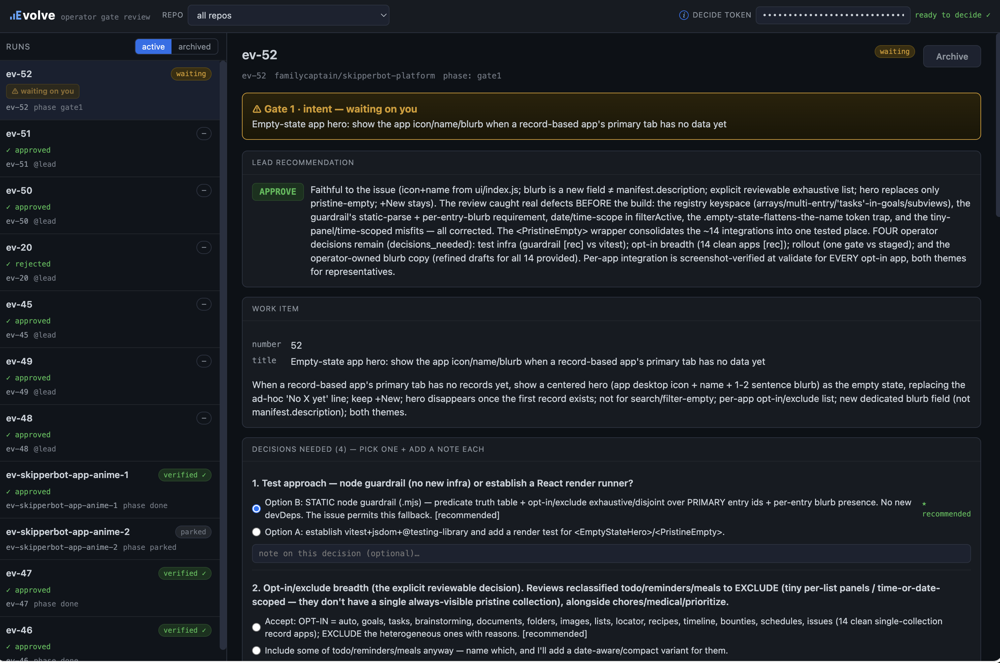
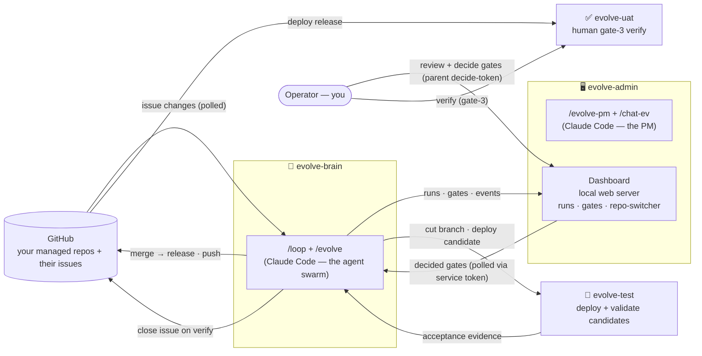

# Evolve

**A Claude Code agent swarm that follows a gated SDLC to automatically code & test your project.**

`v0.1.0` · MIT licensed · runs inside Claude Code

Evolve is a swarm of 20 specialized agents that run your software delivery
loop: it watches your repos' GitHub issues, reproduces and triages them, writes specs, designs and
implements changes, validates them on a test machine, provides screenshot proof of fix, and ships them — stopping at human gates for the calls only you should make. It runs **inside Claude Code**, steered by a human (**you**) at the gates and assisted by a special project management Claude agent that serves as your helper. The only external integration is **GitHub**.

### The 60-second version
You run a **dashboard** + `/evolve-pm` on **evolve-admin** and `/loop /evolve` on **evolve-brain** (both
in Claude Code). The loop watches your repos' GitHub issues, and a swarm of agents reproduces, specs,
builds, and validates each change on **evolve-test** — stopping at two operator gates (**intent →
verify**), with an automated validate gate in between, that you decide in the dashboard. You make the judgment calls; the swarm does the labor. The
only thing that's *yours* is the [charter](./docs/05-the-charter.md) (what your product is) and a
[target adapter](./docs/06-target-adapters.md) (how to deploy + test it).

## What you bring
1. **A charter** — copy [`CHARTER.example.md`](./CHARTER.example.md) to `CHARTER.md` and describe what
   your product *is* and *isn't*. This is the vision authority every agent judges against. It is the
   one piece that is truly yours; everything else is generic.
2. **A repo registry** — the list of repos this Evolve instance manages (and where each one's specs
   live).
3. **A fleet** — four machines (below). They can be VMs, containers, or boxes; any OS (on Windows, run under WSL).
4. **A target adapter** — how to deploy and test *your* project (the one project-specific bit of
   automation).

> **A Claude Code plan sized to how hard you'll run it.** Evolve *is* a Claude Code agent swarm — the
> `/loop` engine, the swarm of agents it spawns, and the `/evolve-pm` assistant all run on **your Claude
> subscription** and consume usage continuously. For a **continuous loop or a serious install, the Max
> plan is strongly recommended** — it's what gives you enough usage headroom to keep the loop running
> without constantly hitting limits. Smaller plans (e.g. Pro) are fine for **trying Evolve out** or a
> light, hands-on cadence, but a real always-on install will outrun them. Budget your plan to how hard
> you intend to run it.

## Architecture

### The fleet
| Machine | Runs | Role |
|---|---|---|
| **evolve-admin** | `/evolve-pm` + `/chat-ev` (Claude Code) **and** the Dashboard web server | Your control surface: review packets, decide gates, switch repos. Holds the **parent decide-token** — only this machine can approve a gate. |
| **evolve-brain** | `/loop` + `/evolve` (Claude Code) | The autonomous engine. Polls issues, runs the agent swarm, cuts branches, reports runs/gates to the dashboard. Holds only a service token — it **cannot** decide its own gates. |
| **evolve-test** | the target adapter's deploy + acceptance | Where candidate changes are deployed and validated before a human ever sees them. |
| **evolve-uat** | the target adapter's deploy (release) | Where **you** verify a shipped change actually works (gate-3) before the issue is closed. |

The **two-token split** is the core safety property: the brain can *do* the work and *propose*
decisions, and its service token may auto-approve **Gate 2 (validate) only** on a green test-host run —
but only the operator (on evolve-admin), holding the decide-token, can *approve* the two operator gates
(**Gate 1** intent and **Gate 3** verify).

## Example workflow

One issue, start to finish. Two human-facing machines are live: **evolve-admin** (you, running
`/evolve-pm` in Claude Code beside the dashboard) and **evolve-brain** (Claude Code running
`/loop /evolve`).

1. **Someone files an issue.** A teammate opens a GitHub issue on one of your managed repos — say
   `your-org/your-app-foo`: *"Saving a profile on the Settings page silently fails — the Save spinner
   just spins forever."* That's the only thing a requester ever has to do.

2. **The loop finds it.** On **evolve-brain**, the `/loop /evolve` session begins its next iteration: it
   scans the issues across your repo collection (`evolve.repos.yaml`), sees this one isn't in its run
   state yet, and opens a run — `ev-42`. On **evolve-admin** you watch `ev-42` appear in the dashboard
   with a live feed of what each agent is doing.

3. **Triage — the intake funnel.** The item is **triaged** first (bug vs feature, deduped, linked to
   existing specs); a feature would also pass **vision-fit** (scope against the charter) and
   **prioritize**. This one is a clear bug, so it survives the funnel.

4. **The spec phase — security screen → reproduce (with before-evidence), then the swarm.** Before any
   code is read, a **security agent**
   screens the issue's *intent* (a real bug report — not someone trying to weaponize the engine). It
   clears, so a **reproduce agent** deploys the current staging branch to **evolve-test**, opens the
   Settings page in a real browser, tries to save, and watches the spinner hang. It then **screenshots
   the broken state and posts it to the GitHub issue as before-evidence** — the engine's built-in
   `attach_image_to_issue` uploads the shot to **catbox.moe** and comments it inline on the issue (so it
   renders even on a private repo). *(catbox is the **default** image host — set `EVOLVE_IMAGE_UPLOAD_CMD` to use any host you want.)* *(If it couldn't reproduce, that's a first-class outcome: it parks at
   Gate 1 saying so and invents no fix.)* With the surface proven, a small swarm goes to work: an agent
   **grounds** in the real code, a **design** agent sets the approach, a **spec-author** writes the
   change as a spec + a bound test, **reviewers** (security / architecture / interop / UX) weigh in, and
   a **lead** agent arbitrates it all into one recommendation.

5. **Gate 1 — you approve the intent.** `ev-42` parks at **Gate 1** in the dashboard with the lead's
   recommendation, the approach, a code-plan sketch, and any decisions it needs from you. You review it
   in the console — or run **`/chat-ev 42`** in your `/evolve-pm` session to talk it through and
   pressure-test the requirements — then approve. Your **decide-token** authorizes it; the brain *cannot*
   approve its own gate.

6. **Build → validate (with after-evidence).** The brain picks up your approval on its next pass,
   implements the fix in an isolated worktree, writes the bound test, runs the dependency-direction
   guard, deploys the candidate to **evolve-test**, and **validates it live** — re-opening the Settings
   page, saving a profile successfully, and **capturing an after-screenshot that it posts to the same
   GitHub issue** (again via the built-in `attach_image_to_issue` → catbox.moe) as proof the fix works.
   You see the whole agent stream in the console.

7. **Gate 2 — validate (automated).** On a **green** validation the loop **auto-approves Gate 2 itself**
   (recorded `decided_by=auto`) — there is no operator decision here. It assembles the result review (the
   diff, the test result, the **before/after screenshots bracketing the change right on the GitHub
   issue**, and the reviewers' verdicts), merges the change to your **staging branch**, and pushes it. *(A
   red validation instead loops back to re-implement — nothing is published.)*

8. **Gate 3 — you verify it for real.** You deploy the staging branch to **evolve-uat** yourself (the
   loop never touches UAT) and `ev-42` parks at
   **Gate 3**. You (or a teammate) actually open the Settings page on the UAT box and save a profile — and
   it saves. It works → you mark it verified and the engine **closes the GitHub issue**. *(If it didn't,
   you bounce it back and the same run resumes — no new conversation.)*

The requester filed one issue; you made two judgment calls — **intent (requirements) and verify (UAT)** —
and the swarm did everything in between (auto-approving the validate gate on green), live in front of you
the whole time.

## Many issues at once — branch-per-issue, concurrent, no collisions

That walkthrough followed one issue, but Evolve runs **many in parallel**, each at its own stage. The
loop is **non-blocking**: every pass it advances the *most-ready* item by one segment and ends, so a
gate **never** stalls the queue. While `ev-42` waits at Gate 3 for your verification, `ev-43` can be
building, `ev-44` parked at Gate 1, and `ev-45` just getting reproduced — all live on the dashboard.

What keeps that safe:

- **One issue = one feature branch = one durable run.** Each issue gets its own `feature/ev-<n>`
  branch and its own state on disk (`ev-<n>`, the run id for life). A build edits **only its own
  isolated git worktree** — never the staging branch, never another issue's branch — and is
  **fail-closed**: if its checkout ends up dirty, the build is discarded, not merged.
- **Resumable from files.** Every item's progress (triage → spec → reviews → diff → gates) is
  persisted, so an item picks up exactly where it left off on a later pass — even if the session
  restarted in between. Items wait on *you* at gates without blocking each other.
- **Interoperability is reviewed, not assumed.** Because multiple specs are in flight, an
  **interop** reviewer checks each change against the others for spec-vs-spec conflicts, and the
  swarm is **cross-item aware** — it can flag when one item supersedes or collides with another
  touching the same code, so two concurrent fixes don't quietly clobber each other.
- **Merging is gated and staged.** A change only reaches your **staging branch** on a **green
  validation** — the loop auto-approves Gate 2, merges `feature/ev-<n>` in, validates the merged result on
  the test host before Gate 3, and the issue stays open until you verify it for real. Each issue lands on
  its own merit.

So you can throw a whole backlog at it and watch the board: many branches, many stages, one queue,
your gates the only synchronization point.

## The agents

The swarm is a roster of single-purpose agents; each pass runs only the ones an item needs. Each is a
curated prompt + a typed output contract (`agents/registry.py`).

| Agent | Phase | What it does |
|---|---|---|
| **triage** | intake | Classify a work item (bug vs feature), dedup, link it to existing specs. |
| **security-screen** | intake | Screen a raw issue's *intent* before anything runs — clear, or block (malicious). |
| **reproduce** | intake | Reproduce the issue on the test host + post a **before**-screenshot to the issue, before any code is read. |
| **vision-fit** | intake | Judge a proposed feature against the charter + the capability's scope. |
| **prioritize** | intake | Score a proposal onto one ranked queue — surface it now or park it. |
| **grounding** | spec | Scan the codebase once and produce a reusable digest for the whole spec team. |
| **design** | spec | Set the system-level approach (how it should work) before the spec is written. |
| **spec-author** | spec | Turn the accepted intent into a spec + a bound test. |
| **spec-audit** | spec | Critique a single spec for gaps, holes, and naive assumptions. |
| **code-scout** | spec | Read-only: sketch *what* code would change for the approach — without writing any. |
| **architecture** | review | Review system fit: module boundaries + the one-directional dependency rule. |
| **security** | review | Review the change for vulnerabilities + supply-chain risk. |
| **interop** | review | Detect spec-vs-spec conflicts — is the desired end-state even satisfiable? |
| **ux** | review | Review UX/UI quality + cross-surface consistency. |
| **lead** | spec | Arbitrate the spec team and own the Gate-1 proposal + recommendation. |
| **implement** | build | Write the code that converges the codebase to the approved spec. |
| **test-author** | build | Write/update the spec's bound acceptance tests. |
| **validate** | build | Deploy to the test host, run the tests + drive the real UI, judge the result (with an **after**-screenshot). |
| **review-packet** | build | Assemble the pre-digested Gate-2 result-review packet (validation, diff, verdicts). |
| **code-audit** | QA | Read code for logic bugs, edge cases, security smells, dead code (proactive QA sweeps). |

## Run it
1. **Clone** this repo onto evolve-admin and evolve-brain.
2. **Configure** (gitignored, per-instance files):
   - `cp .env.example .env` → your **fleet hosts** (`EVOLVE_ADMIN/BRAIN/TEST/UAT_HOST`), the
     **deploy/health** recipe (`EVOLVE_DEPLOY_CMD`, `EVOLVE_HEALTH_PATH`), the **dep-rule** defaults
     (`EVOLVE_PLATFORM_PREFIXES`, `EVOLVE_APP_GLOB`), the **dashboard URL** (`EVOLVE_SERVER_URL`), and the
     **three tokens** (see **Tokens** below).
   - `cp evolve.repos.example.yaml evolve.repos.yaml` → the **collection of repos** this instance watches
     — each with its own path, branches, type, and spec roots.
   - `cp CHARTER.example.md CHARTER.md` → what your product **is** and **isn't** (the vision authority
     every agent grounds against; `CHARTER.skipper-example.md` is a filled-in real example).
   - Drop your **target adapter** into `adapters/<name>/` (deploy/validate/seed recipes for your stack;
     `adapters/example/` is a neutral reference skeleton).
3. **Install Claude Code** on the VMs + authenticate Claude. On evolve-admin, install the dashboard deps:
   `pip install -r dashboard/requirements.txt`.
4. **Start it:** run the dashboard on **evolve-admin** (`uvicorn dashboard.server:app --host 0.0.0.0 --port 8000`) +
   `/evolve-pm` there; run `/loop /evolve` on **evolve-brain** (it reports to the dashboard via
   `$EVOLVE_SERVER_URL`). Evolve begins working your repos' issues, parking at the gates for you.

### Tokens
Three tokens go in `.env` (full notes are inline in `.env.example`):
- **`GITHUB_TOKEN`** — a GitHub **Personal Access Token** (GitHub → Settings → Developer settings →
  Personal access tokens) with **Issues: Read & Write** on your managed repos (+ Contents R/W if Evolve
  pushes branches). A repo in another account uses its own token via that registry entry's `token_env`.
- **`EVOLVE_DECIDE_TOKEN`** and **`EVOLVE_SERVICE_TOKEN`** — secrets **you generate yourself** (not
  issued by any service): `openssl rand -hex 32`. They're the shared bearer the dashboard checks:
  - **decide-token** authorizes gate decisions — put it ONLY in evolve-admin's `.env`; the brain must
    not have it (that's what stops the loop approving its own gates).
  - **service-token** lets the brain push runs/gates to the dashboard — put the SAME value in *both*
    evolve-admin's and evolve-brain's `.env`; it's rejected (403) at the decision endpoint.

## Layout
- `CHARTER.example.md` (tracked template) → `CHARTER.md` (gitignored — your filled-in charter).
- `.env.example` (tracked) → `.env` (gitignored — your config).
- `.claude/skills/` — the Claude Code skills: the `/evolve` loop, `/evolve-pm`, `/chat-ev`, and the
  per-agent skills *(genericized)*.
- `agents/` — the 20 role prompts + the roster (`registry.py`) + the charter-grounding mechanism
  (`charter.py`, `base.py`) *(genericized)*.
- `engine/` — runtime modules: `platform_bridge` (→ the dashboard), `github_connector`, `workspace`,
  and the C/F/S substrate (`store`/`schema`/`cost`/`variance`/`spec_index`) *(pulled + genericized)*.
- `scripts/` — the engine CLIs: `evolve_runs` / `evolve_explain` / `evolve_decide` / `evolve_dep_check`,
  plus `evolve_adapter` (the adapter binding — deploy/health/acceptance/seed/scaffold for your product).
- `dashboard/` — the standalone local web server + SQLite store + SPA (runs/gates/repo-switcher,
  two-token auth) *(built)*.
- `adapters/example/` — the target-adapter interface *(tracked)*; `adapters/<name>/` — your adapter
  *(gitignored, e.g. `adapters/skipper/`)*.
- `docs/sdlc.md` — the agent-swarm + gates flow (Mermaid diagram + narrative).
