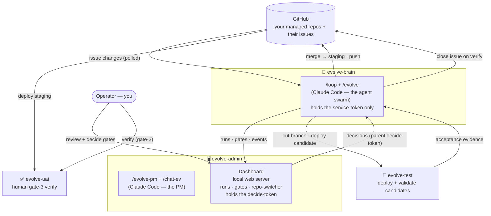

# Architecture & the Fleet

Evolve is a four-machine fleet plus GitHub. Each machine has one job, and the split
between them is what makes the human gates real rather than advisory. This document covers
the fleet, the data flow, the two-token security model, the run lifecycle, where state
lives, and the repo collection.

## The four machines



| Machine | Runs | Why |
|---|---|---|
| **evolve-admin** | `/evolve-pm` + `/chat-ev` (Claude Code) **and** the dashboard web server | Your control surface. You review packets, ask questions, and decide gates here. It holds the **decide-token** — only this machine can approve, change, or reject a gate. |
| **evolve-brain** | `/loop /evolve` (Claude Code) | The autonomous engine. It polls issues, runs the agent swarm, grounds/specs/implements, cuts feature branches, and reports runs and gates to the dashboard. It holds only a **service-token** — it can push work and *propose* decisions but **cannot decide**. |
| **evolve-test** | the target adapter's deploy + validate | The disposable candidate-test box. The brain deploys a candidate here (the feature branch for Gate 2, the merged staging branch for the Gate-3 pre-verify) and drives live acceptance. It never builds or merges. |
| **evolve-uat** | the target adapter's deploy (staging branch) | The human verify box. It tracks the staging branch; you (and your PM) test the shipped candidate by hand at Gate 3 before the issue is closed. Runs mock data so verifying never disturbs a production deployment. |

> **Why four and not fewer?** The split is deliberate. The brain is where untrusted-ish
> automation runs, so it must not hold the power to approve its own work. The admin machine
> is the only place the decide-token lives. The test box is disposable (its git origin *is*
> the brain — it only ever pulls). The UAT box is the operator's clean, mock-data verify
> surface, decoupled from anything in production.

## The data flow

One change, machine by machine:

1. **Issue → brain.** A GitHub issue lands; on its next pass the brain (`/loop /evolve`)
   sees it isn't in run state yet and opens a run, `ev-<n>`.
2. **Brain → dashboard.** As the swarm works — security screen, reproduce, triage, the
   spec phase — the brain reports the run, each agent's start/end, and notable lines to the
   dashboard over HTTP. You watch the live feed on evolve-admin.
3. **Park at a gate → human decides.** When a segment reaches a gate, the brain writes the
   full packet, posts it to the dashboard, and **ends the pass**. The item parks. On the
   dashboard you review it (optionally talk it through with `/chat-ev`), and your PM
   operates the gate on your say-so using the decide-token.
4. **Human decision → brain builds.** A later brain pass calls the dashboard *once* for all
   decided gates, picks the approval up, and runs the next segment — implementing in an
   isolated worktree, running the optional dependency guard (if one is configured).
5. **Brain → test → validates.** The brain deploys the candidate to evolve-test and drives
   live acceptance (Playwright UI + chat), judging on captured evidence (tool-calls, DB
   state, screenshots) — not vibes. Green → Gate 2; red → it loops or escalates.
6. **Merge → push.** On Gate-2 approve the brain merges the feature branch to the staging
   branch and pushes it.
7. **Staging → UAT → verify.** The staging branch deploys to evolve-uat. The item parks at
   Gate 3. You test it live. ✓works closes the GitHub issue; ✗broken resumes the *same* run.
8. **Close.** Only on your verify does Evolve close the issue — closing the loop.

## The two-token security model

This is the core safety property. There are two engine secrets, both generated by you
(`openssl rand -hex 32`):

- **`EVOLVE_DECIDE_TOKEN`** — the **parent / operator** token. It lives **only** in
  evolve-admin's `.env`. The PM uses it (via `scripts/evolve_decide.py`) to approve, change,
  or reject a gate. The brain must never have it.
- **`EVOLVE_SERVICE_TOKEN`** — the **brain / loop** token. The *same* value goes in both
  evolve-admin's and evolve-brain's `.env`. It lets the brain push runs, events, and gate
  packets to the dashboard.

The dashboard enforces the split. From `dashboard/server.py`, `_principal()` maps an
`Authorization: Bearer <token>` header to one of `decide`, `service`, or `unknown`. Two
guards then gate every mutation:

- **`_require_mutator`** — used by run/event/gate *push* endpoints. A `decide` **or**
  `service` token passes.
- **`_require_decide`** — used by the decision-class endpoints: `gates/{id}/decision`,
  `runs/{id}/archive`, `runs/{id}/reverify`. **Only the decide token passes. A service
  token is rejected with HTTP 403** — explicitly: `"a service token cannot decide a gate"`.

So the engine on the brain can do everything *except* decide. It pushes a parked gate via
`engine/platform_bridge.py` `push_gate()` (authenticated with the service token from
`auth()`, whose docstring notes the service flag "permits POSTing gates but NOT deciding
them"). The operator decides via `scripts/evolve_decide.py`, which loads the decide token
from `.env` and POSTs to `/gates/{id}/decision` — and the script itself refuses to run if
`EVOLVE_DECIDE_TOKEN` is unset, and surfaces a clean error on a 403.

**The gates are the control surface.** The brain can propose `approve|change|reject` all day
long; it physically cannot record one. That is what makes "the swarm labors, you review"
an enforced property and not just a convention.

> **Local-dev note:** if *both* tokens are unset, the dashboard allows mutations (for
> single-box development). But even then, a *service* token presented at the decision
> endpoint when one is configured is still 403'd — the engine is never allowed to decide.

## The run lifecycle / phases

A run is one work item from intake to close. Its phase (tracked in the brain's per-item
`state.json`) drives which segment the next loop pass runs:

```
new → gate1 → build → gate2 → verify → done
                                         (terminal: also rejected / parked)
```

- **new** — just opened. The pass runs the **funnel** (triage → for features, vision-fit →
  prioritize) and, for surfaced items, the **spec phase**, which opens with a security
  screen and a live reproduction *before any code is read*, then grounding → design →
  spec-author → code-scout → spec-audit → four reviewers → lead. Ends by pushing **Gate 1**.
- **gate1** — parked for the operator's *intent* decision. `approve` → build; `change` →
  re-spec and re-push Gate 1; `reject` → `rejected`.
- **build** — implement in an isolated worktree, run the isolation check, run the dependency
  optional dependency guard (if configured), deploy to evolve-test, validate live. Ends by
  pushing **Gate 2**.
- **gate2** — parked for the *result* decision. `approve` → merge to the staging branch,
  push, run an automated pre-verify on the test host, then push **Gate 3**; `change` →
  re-implement; `reject` → `rejected`.
- **verify** — parked for the *human* decision on evolve-uat. `approve` (✓works) → close the
  GitHub issue → `done`; `change` (✗broken) → resume the same run (localized bug →
  re-implement → Gate 2; wrong approach → re-design → Gate 1); `reject` → abandon.
- **done** — verified and the issue closed. Terminal.
- **rejected / parked** — terminal off-ramps (rejected at a gate or by the funnel; parked by
  prioritize as low-priority tail).

Because each pass advances one item one segment and then ends, a gate never blocks the loop:
parked items simply wait for a decided gate that a future pass will pick up. (See the
`/evolve` skill and [Gates & the Flow](09-gates-and-the-flow.md) for the full segment map.)

## Where state lives

State is split across three places, by owner:

- **The dashboard's SQLite store** (`dashboard/store.py`, default `~/.evolve/dashboard.db`,
  WAL mode) — the operator-facing truth. Three tables: `run` (status/phase/agent per
  `instance_id`), `gate_queue` (the parked gate, its full JSON `packet`, the decision, who
  decided, the note), and `activity` (the streamed agent events). Upserts merge — a null
  field never clobbers an existing value (COALESCE on every nullable column).
- **The brain's run state** (`$EVOLVE_STATE_DIR/<n>/`, default `~/.evolve/runs`) — the engine-side truth for one run:
  `state.json` (issue#, `instance_id`, title, source, `from_operator`, `phase`,
  `feature_branch`) plus every artifact the spec phase produced (`triage.json`,
  `grounding.json`, `design.json`, `spec*.json`, the reviews, `lead.json`, `code_plan.json`,
  the gate packets). This is what lets a run resume from files: a pass re-hydrates everything
  from here and continues with all prior decisions — it never re-grounds or re-specs. The
  conversation between passes is a cache; the files are the source of truth.
- **The offline outbox** (`engine/platform_bridge.py`, default `~/.evolve/outbox.jsonl`) —
  resilience for the brain→dashboard link. If the dashboard is unreachable (e.g. mid-deploy),
  status/gate/event writes buffer to this FIFO file and flush in order once it's back. Every
  pass flushes first (`list_decided()` drains the outbox before reading decisions), so a
  buffered report goes out even for a parked item whose own pass does no write. A dashboard
  outage degrades gracefully — it never crashes the loop.

## The repo collection

The set of repos one Evolve instance manages lives in **`evolve.repos.yaml`**, loaded by
**`engine/repos.py`** (`load_repos()`). Each entry carries that repo's own config:

```yaml
- name: your-org/your-platform     # owner/repo on GitHub (issue source + push target)
  type: platform                   # platform | app | model | companion
  path: ~/repos/your-platform      # local working path the engine checks out
  branch_model: release->main      # <staging>-><world>  (default release->main)
  spec_roots: ["apps/*/specs", "specs/platform"]
```

- `type` routes deploy behavior: `platform` is worked in place; `app`/`model` clone into
  `apps/<id>` / `models/<id>`; `companion` (e.g. a voice or mobile client) gets specs and
  drafts but you build/test it (no validation harness yet).
- `token_env` lets a repo in a *different* GitHub account use its own token.
- If the registry file is absent (or PyYAML isn't installed), `load_repos()` falls back to a
  single entry from `$GITHUB_REPO` — the degenerate single-repo case still works.

The dashboard's `/repos` endpoint reads this registry to populate the repo-switcher, and
spec/dependency resolution consume each entry's `spec_roots`.

> **Multi-repo is wired.** The registry is the single source of truth for *which* repos Evolve
> manages, and `engine/intake.all_admissible_issues()` scans **every** registered repo each pass
> (each honoring its own `intake` mode; companion repos are skipped). Per-repo config is consumed
> end to end: `engine/repos.py` resolves each repo's `path`, `branch_model` (`repo_branches`),
> `spec_roots`, `token_env`, `type`, `host`, and clone target; `github_connector` uses the repo's
> own `token_env`, so a repo in a different GitHub account authenticates with its own PAT. Run
> state is namespaced per repo (`ev-<n>` for the primary platform repo, `ev-<repo-slug>-<n>` for
> any other), so two repos that each have an issue #5 never collide. The **adapter-binding**
> (`scripts/evolve_adapter.py`) threads `repo`/`repo_type`/`staging_branch`/`world_branch`/
> `host_repo`/`host_path`/`clone_path`/`clone_target` into the deploy op, so a `platform` item
> deploys in place while an `app`/`model` item is cloned into its host platform. See
> [Configuration → The multi-repo model](04-configuration.md#the-multi-repo-model-types-host-and-deploy),
> [Target Adapters](06-target-adapters.md) and
> [Operations & Troubleshooting](10-operations-and-troubleshooting.md).

## Next

- [Installation](03-installation.md) — stand the fleet up.
- [Configuration](04-configuration.md) — `.env`, the tokens, and the repo registry.
- [Gates & the Flow](09-gates-and-the-flow.md) — the full segment-by-segment flow, and the
  canonical diagram in [`sdlc.md`](sdlc.md).
